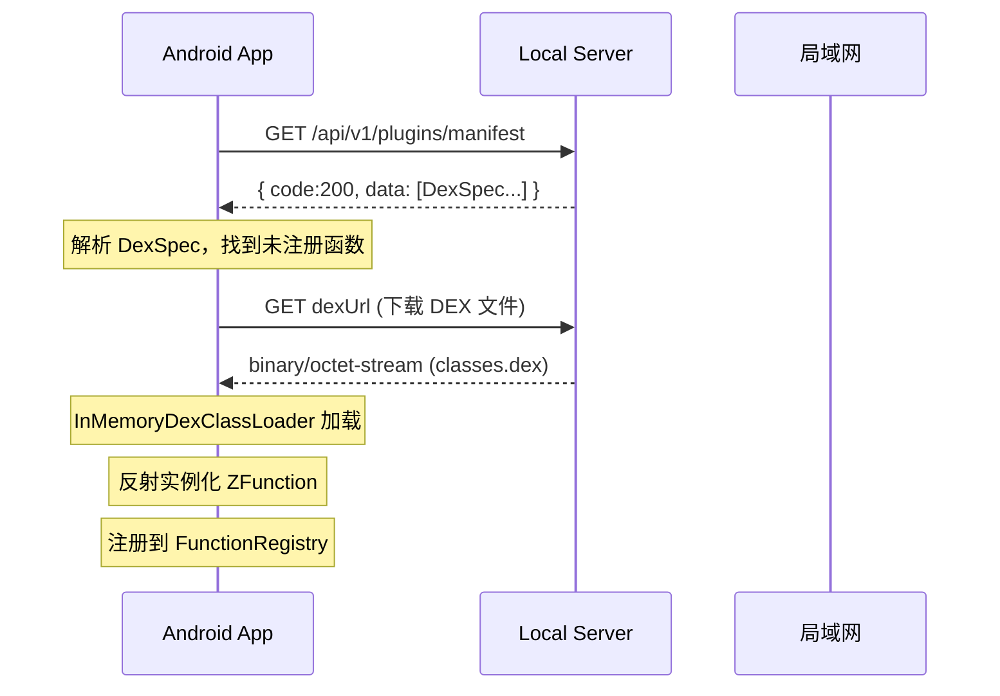

# Android 客户端连接局域网调试指南

## 1. Server 当前状态

Server 运行在本机的 `http://localhost:8080`，局域网内可通过 `http://<本机IP>:8080` 访问。

获取本机 IP（Mac）：
```bash
ifconfig | grep inet
# 类似 192.168.1.xxx
```

---

## 2. Android 端需要修改的点

### 2.1 添加明文 HTTP 支持（Android 9+ 默认禁止 HTTP）

`res/xml/network_security_config.xml`：
```xml
<?xml version="1.0" encoding="utf-8"?>
<network-security-config>
    <domain-config cleartextTrafficPermitted="true">
        <domain includeSubdomains="true">192.168.0.0/16</domain>
        <domain includeSubdomains="true">10.0.0.0/8</domain>
        <domain includeSubdomains="true">localhost</domain>
    </domain-config>
</network-security-config>
```

`AndroidManifest.xml` 中引用：
```xml
<application
    android:networkSecurityConfig="@xml/network_security_config"
    ...>
```

### 2.2 配置 Server Base URL

在 build config 或常量类中添加环境切换：

```kotlin
object ServerConfig {
    // 本地开发：电脑的局域网 IP
    private const val DEV_BASE_URL = "http://192.168.1.100:8080"
    // 生产环境（将来）
    private const val PROD_BASE_URL = "https://api.zutils.com"

    // 当前选中的环境
    var baseUrl: String = DEV_BASE_URL
}
```

### 2.3 Manifest 请求调整

之前客户端可能读的是本地 `assets/dex/dex_manifest.json`，现在改为请求远端。

```kotlin
// DexLoader.kt
suspend fun fetchManifest(): List<DexSpec> {
    val response = httpClient.get("${ServerConfig.baseUrl}/api/v1/plugins/manifest")

    // Server 返回格式：{ code: 200, message: "success", data: [...] }
    val wrapper = json.decodeFromString<ApiResponse<List<DexSpec>>>(response.body())
    return wrapper.data
}
```

对应的 `ApiResponse` 数据类：

```kotlin
@Serializable
data class ApiResponse<T>(
    val code: Int,
    val message: String,
    @SerialName("data") val data: T
)
```

### 2.4 DexSpec 数据类

```kotlin
@Serializable
data class DexSpec(
    @SerialName("functionName") val functionName: String,
    @SerialName("description") val description: String? = null,
    @SerialName("version") val version: String,
    @SerialName("dexUrl") val dexUrl: String,
    @SerialName("className") val className: String,
    @SerialName("checksum") val checksum: String? = null,
    @SerialName("size") val size: Long? = null,
    @SerialName("parameters") val parameters: List<Parameter>? = null,
    @SerialName("requiredPermissions") val requiredPermissions: List<String>? = null,
    @SerialName("dependencies") val dependencies: List<DexDependency>? = null,
)

@Serializable
data class Parameter(
    val name: String,
    val description: String? = null,
    val type: String? = null,
    val required: Boolean = false,
)

@Serializable
data class DexDependency(
    val name: String,
    val version: String,
    val dexUrl: String,
    val checksum: String? = null,
)
```

### 2.5 DEX 下载 URL

Server 返回的 `dexUrl` 已包含完整地址，直接用 OKHttp/Retrofit 下载即可：

```kotlin
// DexDownloader.kt
suspend fun downloadDex(spec: DexSpec): ByteArray {
    // spec.dexUrl = "http://192.168.1.100:8080/api/v1/files/plugin_weather_v1.0.0.dex"
    val response = httpClient.get(spec.dexUrl)
    // 校验 checksum + size...
    return response.body().bytes()
}
```

> 注意：如果有依赖（`dependencies`），需要递归下载每个依赖的 DEX。

---

## 3. 完整调试验证流程



---

## 4. 常用 Server 接口速查（局域网调试用）

| 方法 | URL | 用途 |
|------|-----|------|
| GET | `http://{ip}:8080/api/v1/plugins/manifest` | 客户端获取插件清单 |
| GET | `http://{ip}:8080/api/v1/plugins` | 市场列表（分页） |
| GET | `http://{ip}:8080/api/v1/plugins/{id}` | 插件详情 |
| GET | `http://{ip}:8080/api/v1/files/{filename}` | 下载 DEX 文件 |
| POST | `http://{ip}:8080/api/v1/auth/register` | 注册开发者 |
| POST | `http://{ip}:8080/api/v1/auth/login` | 登录获取 JWT |
| POST | `http://{ip}:8080/api/v1/plugins` | 创建插件 |
| POST | `http://{ip}:8080/api/v1/plugins/{id}/versions` | 上传 DEX + 发布版本 |
| GET | `http://{ip}:8080/swagger-ui.html` | Swagger API 文档（浏览器） |

> 本机调试时 `ip=127.0.0.1`，用 Android 模拟器 "10.0.2.2" 映射到宿主机 localhost。

---

## 5. Server 种子数据

Server 启动时已预置 6 个插件（data.sql）：

| functionName | 说明 | 依赖 |
|-------------|------|------|
| getWeather | 实时天气查询 | 无 |
| generateQRCode | 生成二维码 | zxing-core |
| base64 | Base64 编解码 | 无 |
| generateUUID | 生成 UUID | 无 |
| getDeviceInfo | 设备信息 | 无 |
| translate | 翻译 | 无 |

登录种子账号可管理插件：`zutils-team / admin123`
